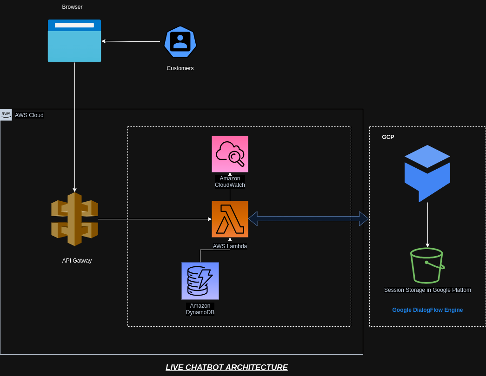

# Live ChatBot

here's an elaboration of the diagram:

---

**Websocket Integration with AWS API Gateway, Lambda, and Google Dialogflow for Live Chatbot Interaction**

In the architecture you've set up, the primary components are the Web Browser, AWS API Gateway (WebSocket), Lambda Function, Google Dialogflow, and the Customer. Here's a detailed breakdown of the flow:

1. **Web Browser**: This represents the user's interface, typically a web application or website. When a user wants to interact with the chatbot, they initiate a request from their web browser.

2. **AWS API Gateway (WebSocket)**: AWS API Gateway serves as the entry point for the user's request. You've set up a WebSocket API here, which allows for two-way communication between the user and the server. This means that once a connection is established, both the server and the client can send messages back and forth without needing to re-establish the connection.

   - **HTTP API Request**: The web browser sends an HTTP API request to the API Gateway to initiate the WebSocket connection.

   - **Response**: After processing, the API Gateway sends back the response to the web browser, which could be the chatbot's reply or any other relevant information.

3. **Lambda Function**: Once the API Gateway receives the request, it invokes the Lambda function. AWS Lambda is a serverless compute service that runs your code in response to events and automatically manages the compute resources for you. In this setup, the Lambda function is responsible for processing the request and integrating with Google Dialogflow.

   - **Invoke**: This represents the action of the API Gateway calling the Lambda function to handle the request.

4. **Google Dialogflow**: Dialogflow is a natural language understanding platform used to design and integrate a conversational user interface into mobile apps, web applications, devices, bots, and more. In this architecture, the Lambda function integrates with Dialogflow to process the user's message and determine the appropriate response based on the chatbot's design.

   - **Integration**: This step signifies the Lambda function's communication with Dialogflow to process the user's message.

5. **Customer**: This represents the end user or the person interacting with the chatbot. The chatbot interaction takes place between Dialogflow and the customer, facilitated by the entire architecture.

   - **Chatbot Interaction**: This is the two-way communication between the customer and Dialogflow, where the customer sends messages and receives responses from the chatbot.

In summary, the architecture you've set up allows for real-time, two-way communication between the user and the chatbot. The user sends a message from their web browser, which goes through the AWS API Gateway and is processed by the Lambda function. The Lambda function then communicates with Google Dialogflow to get the chatbot's response, which is then relayed back to the user through the same path.

## Live Chatbot Architecture

The architecture diagram displays a Live Chatbot system built using AWS and Google Cloud Platform (GCP) services. Let's dissect it:

### Components:

1. **Browser**: Represents the client-side application or webpage from where users will interact with the chatbot.

2. **Customers**: Symbolizes the end-users who are engaging with the chatbot through a browser.

3. **AWS API Gateway**: It acts as an entry point for the Websocket requests from the browser. API Gateway can handle and route requests to AWS Lambda.

4. **AWS Lambda**: A serverless compute service that can run code in response to events. Here, it's used to process user input and interact with Google Dialogflow.

5. **Amazon CloudWatch**: A monitoring service. In this architecture, it seems to be set up for monitoring Lambda's performance and possibly logging requests and responses.

6. **Amazon DynamoDB**: A NoSQL database service. This could be used to store user sessions, chat histories, or any other chat-related data.

7. **Google DialogFlow Engine**: This is the core of the chatbot. It processes the user's input, understands the intent, and generates a relevant response.

8. **Session Storage in Google Platform**: A storage mechanism on GCP, possibly using a service like Firestore or Google Cloud Storage, to keep track of user sessions for the chatbot.

### Flow:

1. A user interacts with the chatbot via a browser.
2. The user's input/request is sent to the AWS API Gateway.
3. API Gateway triggers the AWS Lambda function, passing the user's message as payload.
4. AWS Lambda processes the message and sends it to Google Dialogflow for interpretation and response generation.
5. Dialogflow processes the user's input, may retrieve or store session data in the GCP Session Storage, generates a response, and sends it back to AWS Lambda.
6. AWS Lambda receives the response and can log this interaction in CloudWatch and/or store data in DynamoDB.
7. The response is then sent back through API Gateway to the browser for the user to see.

### Implementation on AWS: (Everything defined at serverless.yaml file)

1. **Set Up API Gateway**:

   - Create a new Websocket in the AWS API Gateway console.
   - Define a method to accept chat messages.
   - Link this method to trigger a Lambda function.

2. **Lambda Function**:

   - Write a Lambda function in a language of your choice (e.g., Python, Node.js).
   - Use the Dialogflow API client library in the Lambda function to send user messages to Dialogflow and fetch responses.
   - Ensure your Lambda has IAM permissions to interact with CloudWatch for logging and DynamoDB for data storage.

3. **DynamoDB**:

   - Set up a table to store chat logs or any relevant data.
   - From Lambda, you can use AWS SDKs to insert, retrieve, or update records in DynamoDB.

4. **Integration with Dialogflow**:

   - You'll need to set up authentication with GCP, usually using a service account JSON key.
   - In the Lambda function, use this key to authenticate and interact with the Dialogflow API.

5. **CloudWatch**
   - It's created by default from the Lambda function using serverless yaml configuration.
